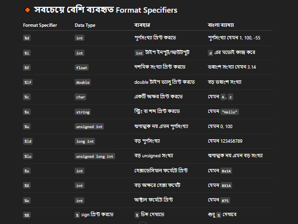

# ✅ C Programme Journey
## 💻 What is C programing language?

### 🧠 Definition

A C Program is a set of instructions written in the C programming language to perform a specific task.It follows the structure and syntax defined by the C language, which is a general-purpose, high-performance programming language.

C was developed by Dennis Ritchie in 1972 at Bell Labs.

---
### Bangla Edition -
(C প্রোগ্রাম হলো C প্রোগ্রামিং ভাষায় লেখা নির্দেশনার একটি সেট, যা একটি নির্দিষ্ট কাজ সম্পাদনের জন্য ব্যবহার করা হয়। এটি C ভাষার গঠন (structure) ও সিনট্যাক্স (syntax) অনুসরণ করে, যা একটি সাধারণ উদ্দেশ্য (general-purpose), উচ্চ-দক্ষতার (high-performance) প্রোগ্রামিং ভাষা।

C ভাষা ১৯৭২ সালে ডেনিস রিচি (Dennis Ritchie) দ্বারা Bell Labs-এ ডেভেলপ করে।)

---
### 💻 C programme Data Type -
🧠 What is a Data Type?

A data type in programming (especially in C) defines the type of data a variable can store. It tells the compiler what kind of value (such as integer, float, character, etc.) will be stored in that variable.

---
### Bangla Edition -
🧠 Data Type কী?

Data Type হলো কোনো ভ্যারিয়েবল কী ধরনের মান (value) সংরক্ষণ করবে — সেটা নির্ধারণ করে।
যেমন: পূর্ণসংখ্যা, দশমিক সংখ্যা, অক্ষর, বড় মান ইত্যাদি।

### 🧠 Main Categories of Data Types in C:
1. Primary (Built-in) Data Types
2. Derived Data Types
3. User-Defined Data Types
4. Void Type
### ✅ 1. Primary (Built-in) Data Types


| Date Type | Description | Size (Typical)|Example |
|---|---|---|---|
| int | Integer numbers | 4 bytes|int age = 25; |
| float	 | Decimal numbers (single precision) |  4 bytes|float pi = 3.14; |
| double |Decimal numbers (double precision) | 8 bytes|double d = 2.718;|
| char | Single character | 1 byte|char grade = 'A'; |

---

### 🔁 Variations of Primary Data Types-
| Type | Description  |Example |
|---|---|---|
| short int | Smaller range of integers (2 bytes)	 |short int x = 1000;|
| long int |Larger range of integers|long int big = 1000000; |
| unsigned int|Only positive integers (no negatives) |unsigned int x = 300;|
|long double |More precision for floating-point |long double pi = 3.14159;|

---

### 🧩 Derived Data Types-
 These are based on the primary types.
|Data Type | Description  |Example |
|---|---|---|
| array | Collection of values of the same type |int numbers[5] = {1,2,3,4,5};|
| pointer |Stores the address of a variable|long int *ptr = &x; |
| function|A block of code that performs a task |int add(int a, int b) { ... }|
|string|Array of characters (not built-in type)|char name[] = "John";|

---

### 🧑‍💻 User-Defined Data Types- 
 Created by the user using built-in types.

 🚫 Void Type - last ones
|Keyword | Description  |Example |
|---|---|---|
|struct	 | Group of different data types |struct Person { int age; char name[20]; };|
| union |Memory shared by all members|	union Data { int i; float f; };|
| enum|Set of named integer constants |enum Color { RED, GREEN, BLUE };|
|typedef|Create a new name for a data type|typedef int Marks;|
|void |	No value or return type|void sayHello() { ... }|

---
## 🚫C Programming Format Specifiers - Complete Details
Format specifiers are used in C programming to specify the type of data being printed or scanned using printf() and scanf() functions. Each format specifier starts with a percentage symbol (%) followed by a character that indicates the type of data.

### Bangla Edition -
## ✅ C প্রোগ্রামিং ফরম্যাট স্পেসিফায়ার (Format Specifiers) — বিস্তারিত বাংলায়:

C প্রোগ্রামিং ভাষায় printf() এবং scanf() ফাংশনের মাধ্যমে ডেটা ইনপুট ও আউটপুটের সময় কোন ধরনের ডেটা (যেমন: সংখ্যা, ভগ্নাংশ, অক্ষর, স্ট্রিং ইত্যাদি) প্রদর্শন বা গ্রহণ করা হবে তা বোঝাতে ফরম্যাট স্পেসিফায়ার ব্যবহার করা হয়।

প্রত্যেকটি ফরম্যাট স্পেসিফায়ার % চিহ্ন দিয়ে শুরু হয় এবং এরপরে একটি নির্দিষ্ট অক্ষর থাকে যা ডেটা টাইপ নির্দেশ করে।

  Below is a complete list of commonly used format specifiers in C, along with their meaning and examples.
  
1. %d or %i
- Used for: Signed int (integer)
- Example: printf("%d", 10); or scanf("%d", &x);
- Description: Prints or reads a signed decimal integer.

2.%u
- Used for: Unsigned int
- Example: printf("%u", 100);
- Description: Prints an unsigned decimal integer.
  

3.%f

- Used for: Float
- Example: printf("%f", 3.14);
- Description: Prints a floating-point number with six digits after decimal by default.

4.%lf

- Used for: Double
- Example: scanf("%lf", &d);
- Description: Used for reading double values with scanf().

5.%c
- Used for: Character
- Example: printf("%c", 'A');
- Description: Prints or reads a single character.

6.%s

- Used for: String
- Example: printf("%s", "Hello");
- Description: Prints or reads a sequence of characters (string).

7.%ld

- Used for: Long int
- Example: printf("%ld", 123456789L);
- Description: Prints a long signed integer.

8.%lu

- Used for: Unsigned long int
- Example: printf("%lu", 123456789UL);

9.%lld

- Used for: Long long int
- Example: printf("%lld", 9223372036854775807LL);

10. %llu

- Used for: Unsigned long long int
- Example: printf("%llu", 18446744073709551615ULL);

11. %x or %X

- Used for: Hexadecimal integer
- Example: printf("%x", 255); // Output: ff
- Description: Lowercase (x) or uppercase (X) hexadecimal representation.

12. %o

- Used for: Octal integer
- Example: printf("%o", 10); // Output: 12

13. %e or %E

- Used for: Scientific notation of float or double
- Example: printf("%e", 1234.56);

14. %g or %G

- Used for: Shorter of %e and %f
- Description: Automatically chooses between %f or %e depending on the value.

15.%%

- Used for: Printing the % symbol
- Example: printf("Progress: 80%%");

### Note:

%f is used for both float and double when using printf(). But for scanf(), use %f for float and %lf for double.

Format specifiers can be modified with precision and width. For example: %.2f prints a float with 2 digits after the decimal point.

## ❤Format Specifiers Table💥
| Format Specifier| Data Type |Description | Example Output | 
| --- |---| --- |--- |
| %d or %i | int| Signed decimal integer | 10| 
| %u| unsigned int | Unsigned decimal integer | 100  | 
| %f| float | Floating-point number (6 decimal digits) |3.141593 | 
| %.nf| float/double | Floating number with n decimal places | %.2f → 3.14  | 
| %lf | double| Double (used with scanf)| -- | 
| %c| char | Single character | A| 
| %s| string| Null-terminated string | Hello | 
| %ld|long int|Signed long integer | 123456789| 
| %lld|long long int | Signed long long integer | 9223372036854775807  | 
| %x| unsigned int| Hexadecimal (lowercase) | ff | 
| %X| unsigned int | Hexadecimal (uppercase)| FF | 
| %o|unsigned int| Octal number | 12  | 
| %e or %E| float/double | Scientific notation | 1.234560e+03 | 
| %g or %G| float/double| Shortest of %f or %e |1234.56 or 1.23456e+03 |
|%%	| -	- |Prints a percent (%) sign | % |  
---


## ✅ C প্রোগ্রামের মৌলিক স্ট্রাকচার (Structure of a C Program)-

- #include <stdio.h> -- ইনপুট-আউটপুট ফাংশনের জন্য প্রয়োজনীয় হেডার ফাইল।
- 🔹 stdio.h মানে Standard Input Output Header File।
- int main()  -- প্রোগ্রামের সূচনাবিন্দু।
- printf(...) -- স্ক্রিনে টেক্সট প্রিন্ট করে।
- return 0;	 -- প্রোগ্রামের সফল সমাপ্তি নির্দেশ করে।
- 🔹 return 0; মানে প্রোগ্রাম সফলভাবে শেষ হয়েছে।
---
 ### প্রতিটি C প্রোগ্রাম সাধারণত নিচের মত স্ট্রাকচারে লেখা হয়:
 ```c
 // 1. Preprocessor Directives (Header Files)
#include <stdio.h>

// 2. Global Declarations (optional)
int globalVar = 10;

// 3. Function Declarations (Prototypes)
void greet();

// 4. main() Function - Entry Point
int main() {
    // Variable Declarations
    int num = 5;

    // Statements / Function Calls
    printf("Hello, World!\n");
    greet();

    return 0; // Program ends
}

// 5. Function Definitions
void greet() {
    printf("Welcome to C Programming!\n");
}

 ```
 ### প্রতিটি অংশের ব্যাখ্যা (In Bangla):
- Preprocessor Directives – #include দিয়ে স্ট্যান্ডার্ড লাইব্রেরি বা কাস্টম হেডার ফাইল যোগ করা হয়। যেমন: #include <stdio.h>।
- Global Declarations – প্রোগ্রামের যেকোনো জায়গায় ব্যবহার করার জন্য ভেরিয়েবল বা কনস্ট্যান্ট ঘোষণা।
- Function Declarations / Prototypes – মূল ফাংশন ব্যবহারের আগে তার ঘোষণা দেওয়া হয়।
- main() Function – প্রতিটি C প্রোগ্রামের শুরু main() ফাংশন থেকে হয়।
- Function Definitions – যেসব ফাংশনের ঘোষণা আগেই দেওয়া হয়েছিল, তাদের সংজ্ঞা (definition) এখানে দেওয়া হয়।

---
##  Write a programme that prints Hello World .

> C programme syntax

`#include <stdio.h>`
```c
// int = keyword
// main = function
// printf = function
// ; = semicolone
#include <stdio.h>
int main()
{
    printf("Hello World");
}
```

## Write a programme that prints integer number.
```c
#include <stdio.h>
int main()
{
    int number =30;
    printf("This Number is %d",number);
}
```
> Other Example
```c
#include <stdio.h>
int main()
{
    int number =40;
    int number1 = 60;
    printf("This number are %d, %d",number, number1);
}
```

## Write a programme and  prints floating , double number and character .
```c
#include <stdio.h>
int main()
{
    float rollNumber = 20;
    double amnoutNumber = 100.022;
    char ch = 'a';
    printf("This is a Floating Number %f\n", rollNumber);
    printf("This is a amount Number %lf\n", amnoutNumber);
    printf("This is a character Name %c\n", ch);
}
```

## Write a programme that takes and int, and print that number.
```c
#include <stdio.h>
int main()
{
    int number;
    // user the enter number
    printf("Please Enter the Number = ");
    // read the number from the user
    scanf("%d",&number);
    // print the entered number
    printf("Print this number is = %d",number);
}
```

